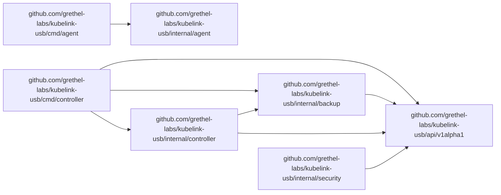
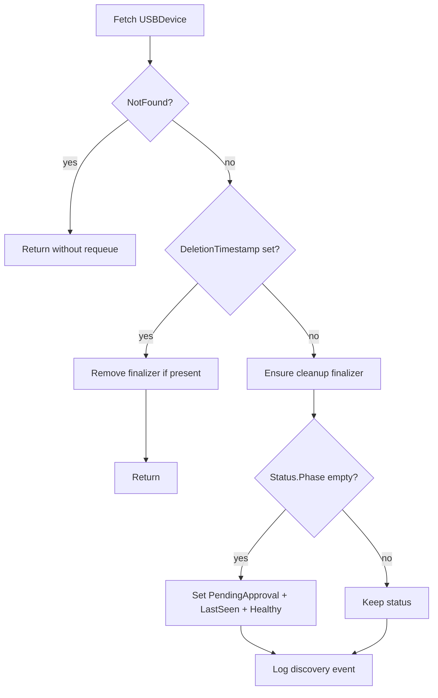
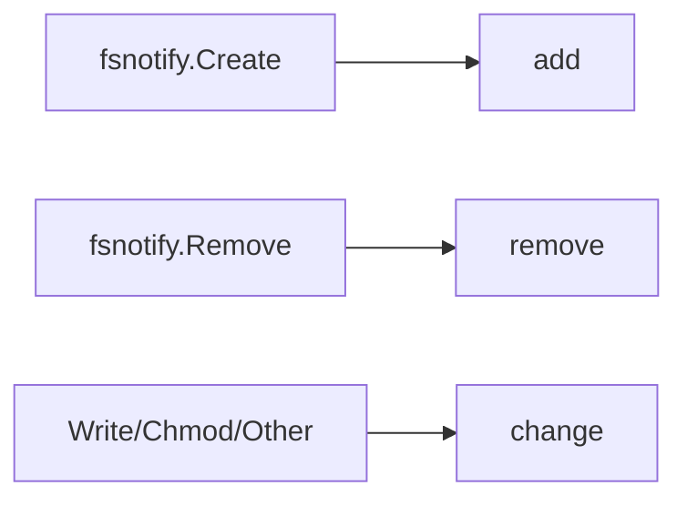

# Code Reference and Diagrams

_Generated by `hack/generate-code-reference.sh` from the current Go source tree._

## Unified Commenting System

Use this structure for exported types and functions:

```go
// <Name> <short intent sentence>.
//
// Intent: <why this exists>
// Inputs: <important inputs>
// Outputs: <important outputs>
// Errors: <error contract or current stub behavior>
```

## Package Inventory

| Package | Role |
| --- | --- |
| `github.com/grethel-labs/kubelink-usb/api/v1alpha1` | CRD API types and deep-copy behavior |
| `github.com/grethel-labs/kubelink-usb/cmd/agent` | node agent entrypoint |
| `github.com/grethel-labs/kubelink-usb/cmd/controller` | controller placeholder entrypoint |
| `github.com/grethel-labs/kubelink-usb/internal/agent` | node-local discovery and attach/export stubs |
| `github.com/grethel-labs/kubelink-usb/internal/backup` | backup/restore storage and snapshot logic |
| `github.com/grethel-labs/kubelink-usb/internal/controller` | reconcile loop and object lifecycle |
| `github.com/grethel-labs/kubelink-usb/internal/security` | policy and TLS defaults |
| `github.com/grethel-labs/kubelink-usb/internal/usbip` | USB/IP protocol/data-plane stubs |
| `github.com/grethel-labs/kubelink-usb/internal/utils` | pure helper functions |

## Module Dependency Diagram (Generated)



## Controller Reconcile Flow



## Agent Discovery Event Normalization


