# Auto-Generated Diagrams

_Generated from `@doc` annotations in Go source by `hack/generate-diagrams.sh`._

---

## Component Overview

### Backup Storage

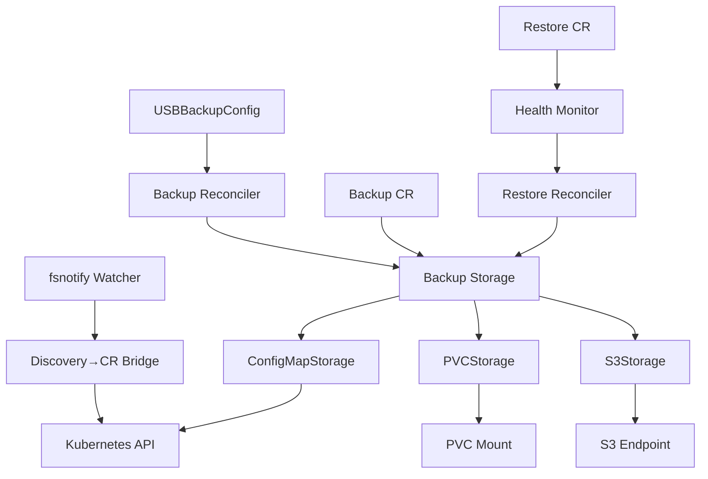
```mermaid
flowchart TB
    BackupReconciler["Backup Reconciler"] --> Storage["Backup Storage"]
    Backup["Backup CR"] --> Storage["Backup Storage"]
    Bridge["Discovery→CR Bridge"] --> K8sAPI["Kubernetes API"]
    CMStorage["ConfigMapStorage"] --> K8sAPI["Kubernetes API"]
    Discovery["fsnotify Watcher"] --> Bridge["Discovery→CR Bridge"]
    HealthMonitor["Health Monitor"] --> RestoreReconciler["Restore Reconciler"]
    PVCBackupStorage["PVCStorage"] --> Filesystem["PVC Mount"]
    RestoreReconciler["Restore Reconciler"] --> Storage["Backup Storage"]
    Restore["Restore CR"] --> HealthMonitor["Health Monitor"]
    S3BackupStorage["S3Storage"] --> S3Bucket["S3 Endpoint"]
    Storage["Backup Storage"] --> CMStorage["ConfigMapStorage"]
    Storage["Backup Storage"] --> PVCBackupStorage["PVCStorage"]
    Storage["Backup Storage"] --> S3BackupStorage["S3Storage"]
    USBBackupConfigCR["USBBackupConfig"] --> BackupReconciler["Backup Reconciler"]
```

### Policy Engine

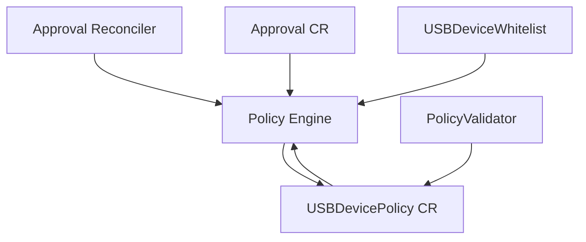
```mermaid
flowchart TB
    ApprovalReconciler["Approval Reconciler"] --> PolicyEngine["Policy Engine"]
    Approval["Approval CR"] --> PolicyEngine["Policy Engine"]
    PolicyCR["USBDevicePolicy CR"] --> PolicyEngine["Policy Engine"]
    PolicyEngine["Policy Engine"] --> PolicyCR["USBDevicePolicy CR"]
    PolicyValidatorWH["PolicyValidator"] --> PolicyCR["USBDevicePolicy CR"]
    WhitelistCR["USBDeviceWhitelist"] --> PolicyEngine["Policy Engine"]
```

### USBDevice CR

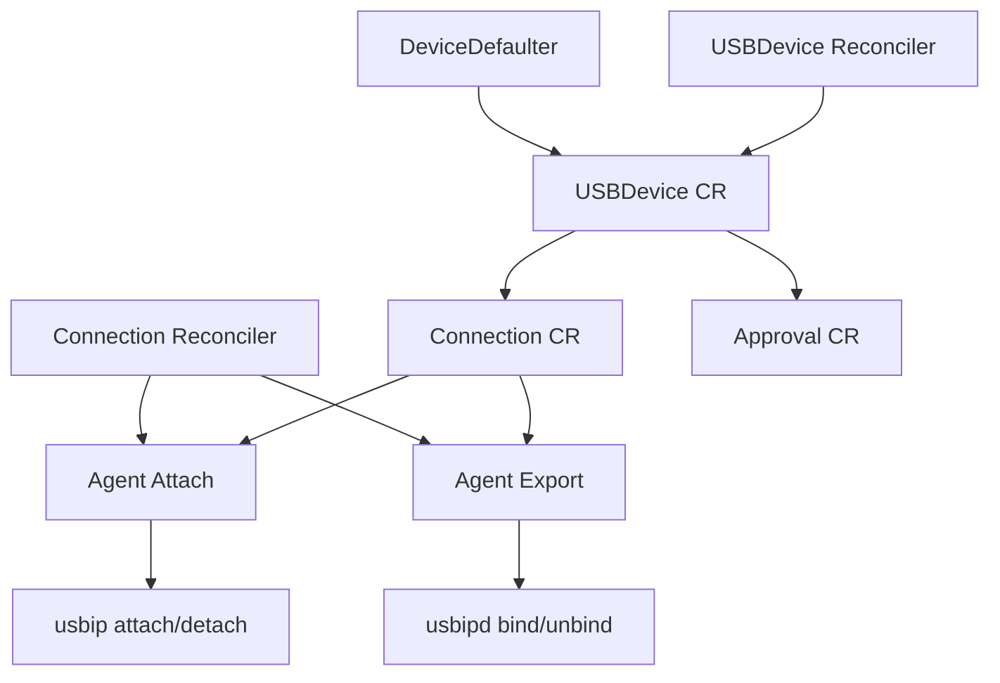
```mermaid
flowchart TB
    AgentClient["Agent Attach"] --> USBIP["usbip attach/detach"]
    AgentServer["Agent Export"] --> USBIPd["usbipd bind/unbind"]
    ConnReconciler --> AgentClient["Agent Attach"]
    ConnReconciler["Connection Reconciler"] --> AgentServer["Agent Export"]
    DeviceDefaulterWH["DeviceDefaulter"] --> USBDevice["USBDevice CR"]
    DeviceReconciler["USBDevice Reconciler"] --> USBDevice["USBDevice CR"]
    USBConnection --> AgentClient["Agent Attach"]
    USBConnection["Connection CR"] --> AgentServer["Agent Export"]
    USBDevice --> USBConnection["Connection CR"]
    USBDevice["USBDevice CR"] --> USBDeviceApproval["Approval CR"]
```

---

## Entity Relationships

### BackupDestination

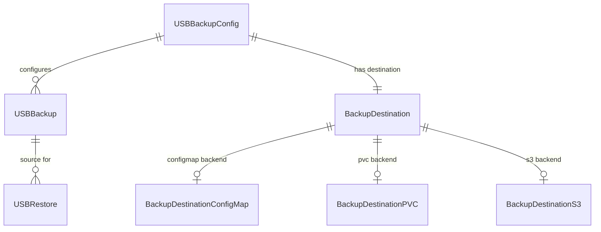
```mermaid
erDiagram
    BackupDestination ||--o| BackupDestinationConfigMap : "configmap backend"
    BackupDestination ||--o| BackupDestinationPVC : "pvc backend"
    BackupDestination ||--o| BackupDestinationS3 : "s3 backend"
    USBBackup ||--o{ USBRestore : "source for"
    USBBackupConfig ||--o{ USBBackup : "configures"
    USBBackupConfig ||--|| BackupDestination : "has destination"
```

### USBDevice

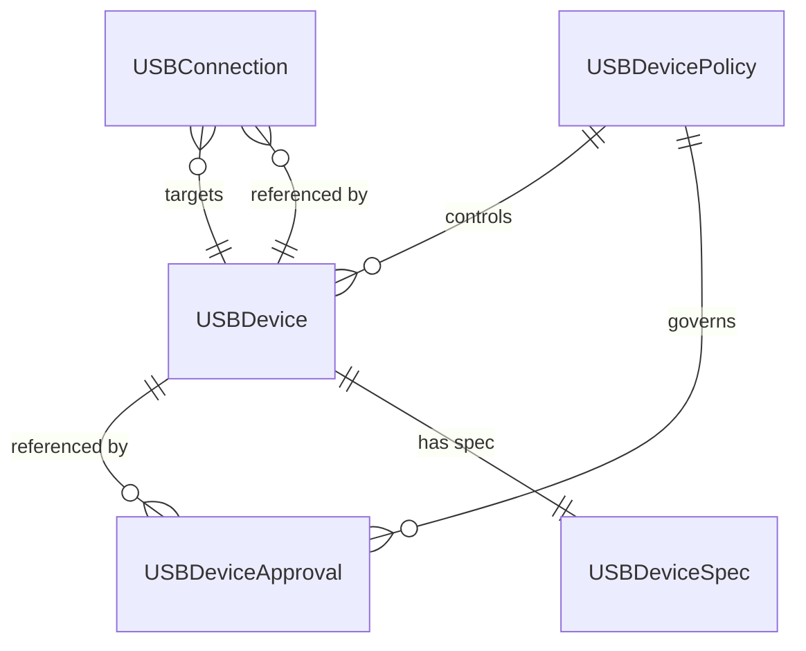
```mermaid
erDiagram
    USBConnection }o--|| USBDevice : "targets"
    USBDevice ||--o{ USBConnection : "referenced by"
    USBDevice ||--o{ USBDeviceApproval : "referenced by"
    USBDevice ||--|| USBDeviceSpec : "has spec"
    USBDevicePolicy ||--o{ USBDevice : "controls"
    USBDevicePolicy ||--o{ USBDeviceApproval : "governs"
```

### WhitelistEntry

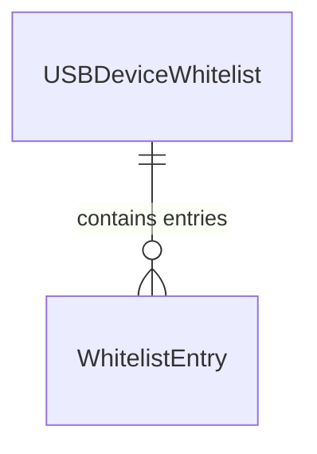
```mermaid
erDiagram
    USBDeviceWhitelist ||--o{ WhitelistEntry : "contains entries"
```

---

## State Transitions

### Usbbackup (CRD)

_Source: `api/v1alpha1/usbbackup_types.go`_

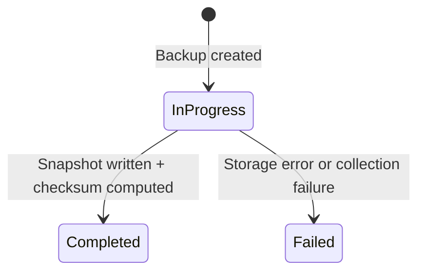
```mermaid
stateDiagram-v2
    InProgress --> Completed : Snapshot written + checksum computed
    InProgress --> Failed : Storage error or collection failure
    [*] --> InProgress : Backup created
```

### Usbconnection (CRD)

_Source: `api/v1alpha1/usbconnection_types.go`_

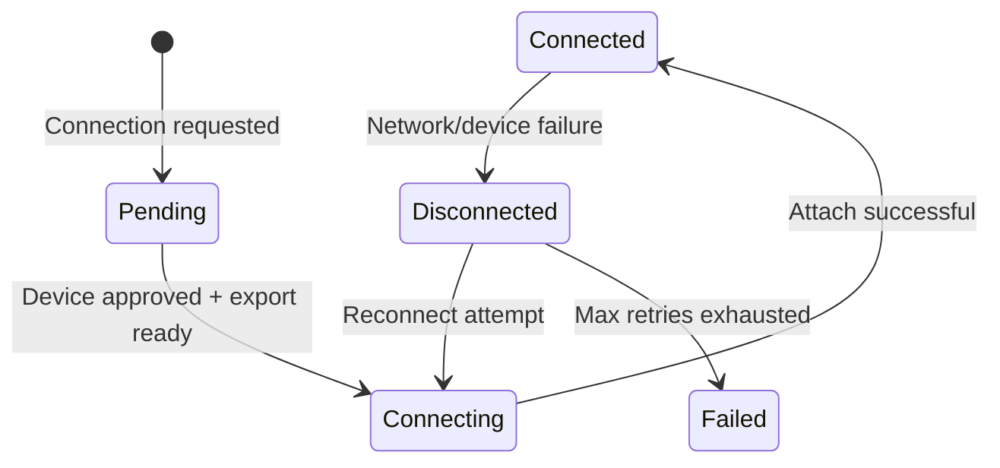
```mermaid
stateDiagram-v2
    Connected --> Disconnected : Network/device failure
    Connecting --> Connected : Attach successful
    Disconnected --> Connecting : Reconnect attempt
    Disconnected --> Failed : Max retries exhausted
    Pending --> Connecting : Device approved + export ready
    [*] --> Pending : Connection requested
```

### Usbdevice (CRD)

_Source: `api/v1alpha1/usbdevice_types.go`_

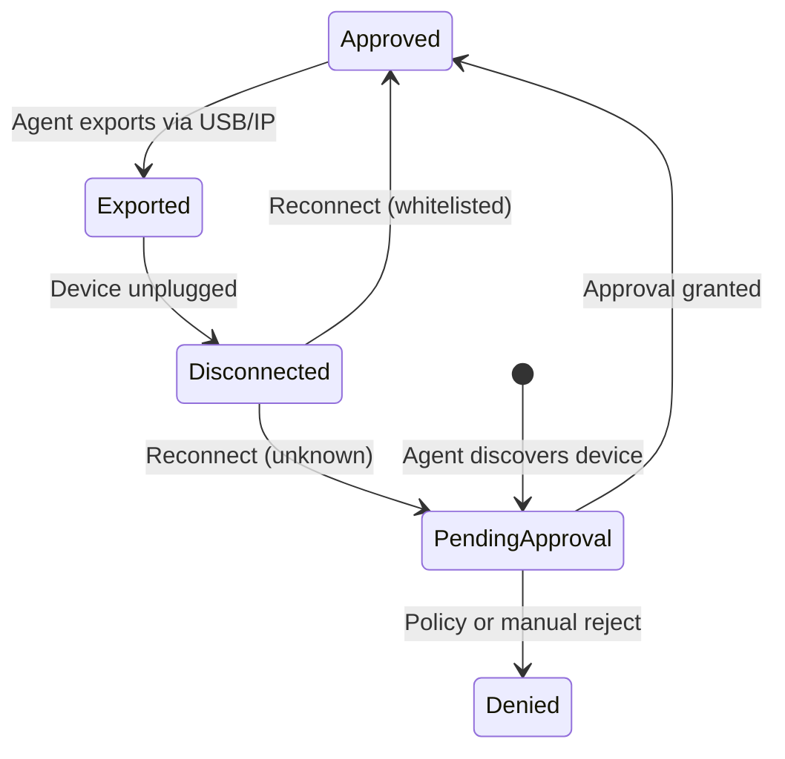
```mermaid
stateDiagram-v2
    Approved --> Exported : Agent exports via USB/IP
    Disconnected --> Approved : Reconnect (whitelisted)
    Disconnected --> PendingApproval : Reconnect (unknown)
    Exported --> Disconnected : Device unplugged
    PendingApproval --> Approved : Approval granted
    PendingApproval --> Denied : Policy or manual reject
    [*] --> PendingApproval : Agent discovers device
```

### Usbdeviceapproval (CRD)

_Source: `api/v1alpha1/usbdeviceapproval_types.go`_

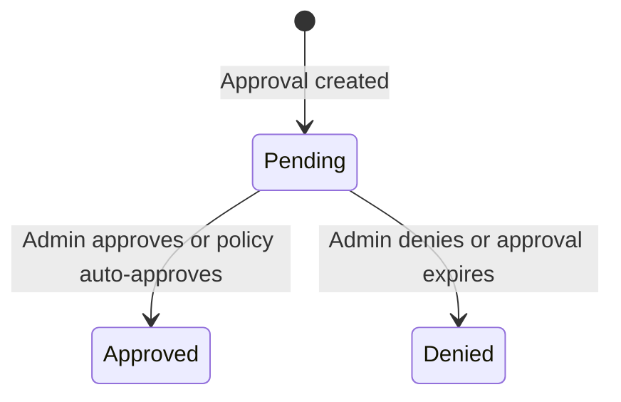
```mermaid
stateDiagram-v2
    Pending --> Approved : Admin approves or policy auto-approves
    Pending --> Denied : Admin denies or approval expires
    [*] --> Pending : Approval created
```

### Usbrestore (CRD)

_Source: `api/v1alpha1/usbrestore_types.go`_

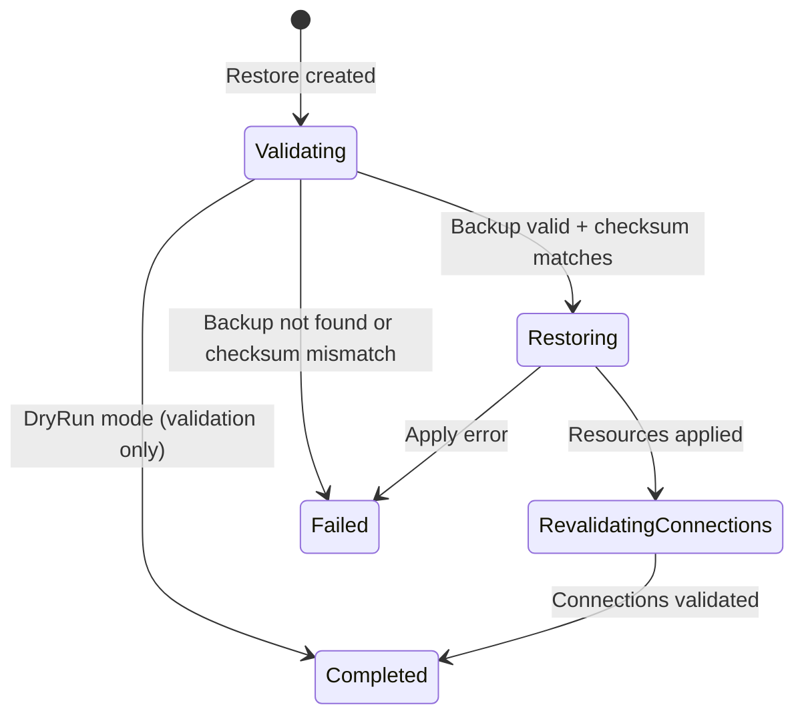
```mermaid
stateDiagram-v2
    Restoring --> Failed : Apply error
    Restoring --> RevalidatingConnections : Resources applied
    RevalidatingConnections --> Completed : Connections validated
    Validating --> Completed : DryRun mode (validation only)
    Validating --> Failed : Backup not found or checksum mismatch
    Validating --> Restoring : Backup valid + checksum matches
    [*] --> Validating : Restore created
```

---

## Processing Flows

### Bridge (Agent)

_Source: `internal/agent/bridge.go`_

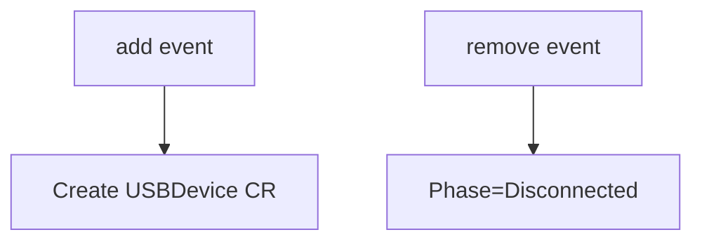
```mermaid
flowchart TD
    OnAdd["add event"] --> CreateCR["Create USBDevice CR"]
    OnRemove["remove event"] --> SetDisconnected["Phase=Disconnected"]
```

### Discovery (Agent)

_Source: `internal/agent/discovery.go`_

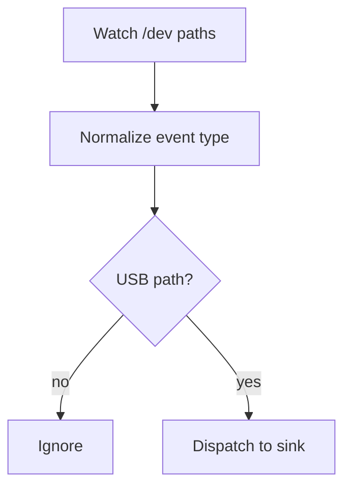
```mermaid
flowchart TD
    FilterUSB -->|no| Ignore["Ignore"]
    FilterUSB -->|yes| DispatchSink["Dispatch to sink"]
    NormalizeEvent --> FilterUSB{"USB path?"}
    WatchPaths["Watch /dev paths"] --> NormalizeEvent["Normalize event type"]
```

### Approval (Controller)

_Source: `internal/controller/approval_controller.go`_

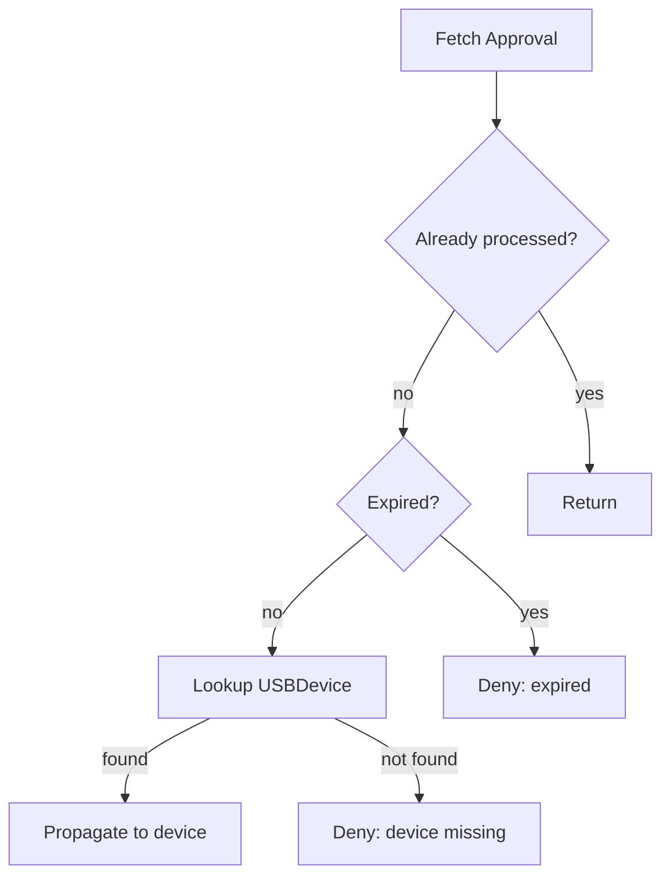
```mermaid
flowchart TD
    AlreadyDone -->|no| CheckExpiry{"Expired?"}
    AlreadyDone -->|yes| SkipReturn["Return"]
    CheckExpiry -->|no| LookupDevice["Lookup USBDevice"]
    CheckExpiry -->|yes| DenyExpired["Deny: expired"]
    FetchApproval["Fetch Approval"] --> AlreadyDone{"Already processed?"}
    LookupDevice -->|found| PropagatePhase["Propagate to device"]
    LookupDevice -->|not found| DenyMissing["Deny: device missing"]
```

### Backup (Controller)

_Source: `internal/controller/backup_controller.go`_

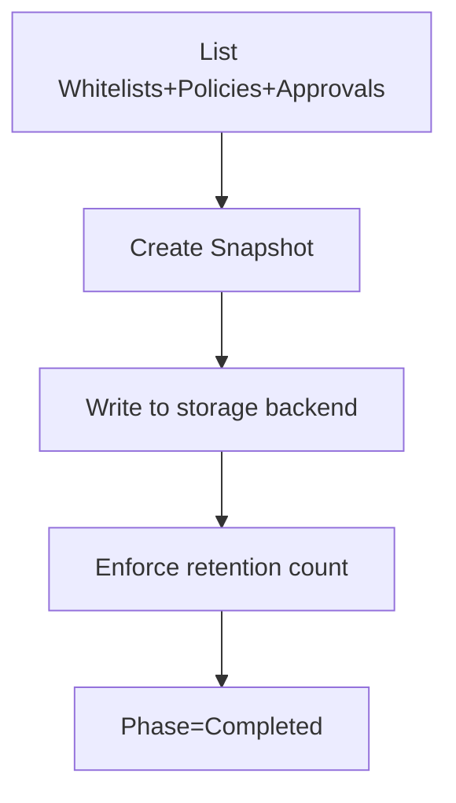
```mermaid
flowchart TD
    CollectCRs["List Whitelists+Policies+Approvals"] --> CreateSnapshot["Create Snapshot"]
    CreateSnapshot --> WriteStorage["Write to storage backend"]
    EnforceRetention --> MarkCompleted["Phase=Completed"]
    WriteStorage --> EnforceRetention["Enforce retention count"]
```

### Health Monitor (Controller)

_Source: `internal/controller/health_monitor.go`_

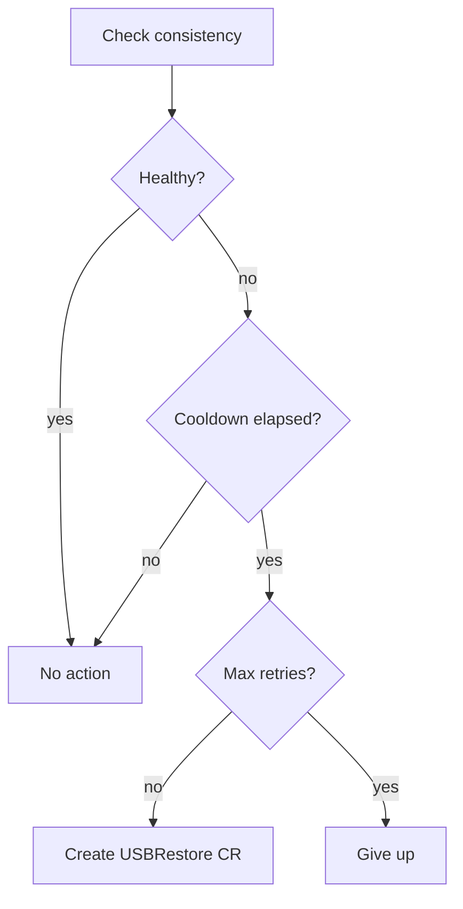
```mermaid
flowchart TD
    CheckCooldown -->|no| Done
    CheckCooldown -->|yes| CheckRetries{"Max retries?"}
    CheckHealth["Check consistency"] --> IsHealthy{"Healthy?"}
    CheckRetries -->|no| TriggerRestore["Create USBRestore CR"]
    CheckRetries -->|yes| GiveUp["Give up"]
    IsHealthy -->|no| CheckCooldown{"Cooldown elapsed?"}
    IsHealthy -->|yes| Done["No action"]
```

### Restore (Controller)

_Source: `internal/controller/restore_controller.go`_

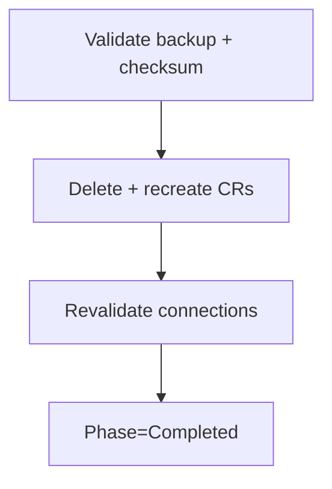
```mermaid
flowchart TD
    ApplyResources --> RevalidateConns["Revalidate connections"]
    RevalidateConns --> MarkCompleted["Phase=Completed"]
    ValidateBackup["Validate backup + checksum"] --> ApplyResources["Delete + recreate CRs"]
```

### Usbconnection (Controller)

_Source: `internal/controller/usbconnection_controller.go`_

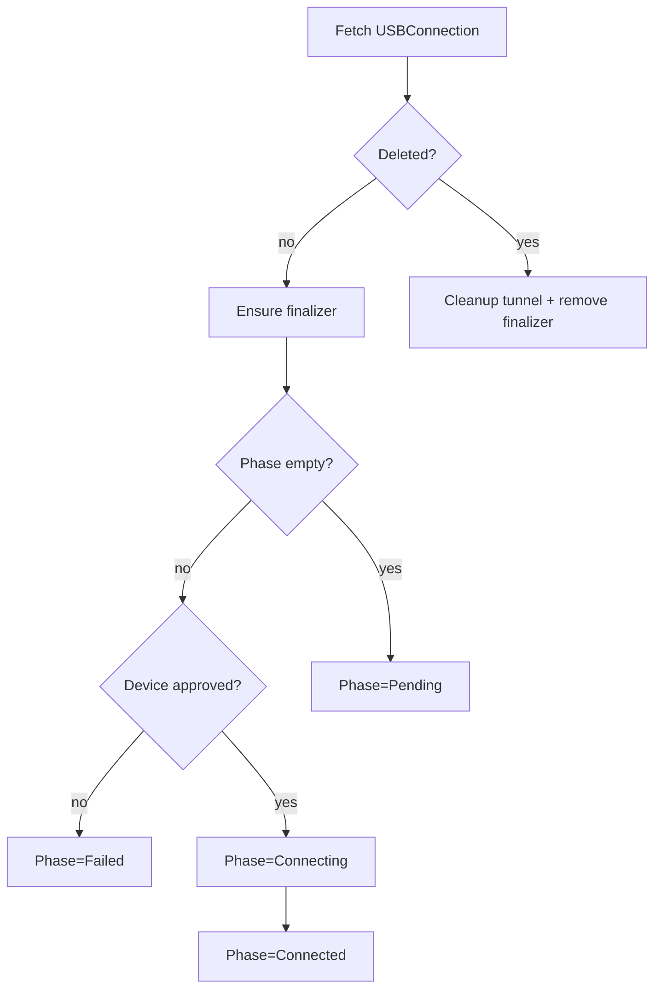
```mermaid
flowchart TD
    CheckApproval -->|no| MarkFailed["Phase=Failed"]
    CheckApproval -->|yes| SetConnecting["Phase=Connecting"]
    CheckDel -->|no| EnsureFin["Ensure finalizer"]
    CheckDel -->|yes| CleanupTunnel["Cleanup tunnel + remove finalizer"]
    CheckPhase -->|no| CheckApproval{"Device approved?"}
    CheckPhase -->|yes| SetPending["Phase=Pending"]
    EnsureFin --> CheckPhase{"Phase empty?"}
    FetchConn["Fetch USBConnection"] --> CheckDel{"Deleted?"}
    SetConnecting --> SetConnected["Phase=Connected"]
```

### Usbdevice (Controller)

_Source: `internal/controller/usbdevice_controller.go`_

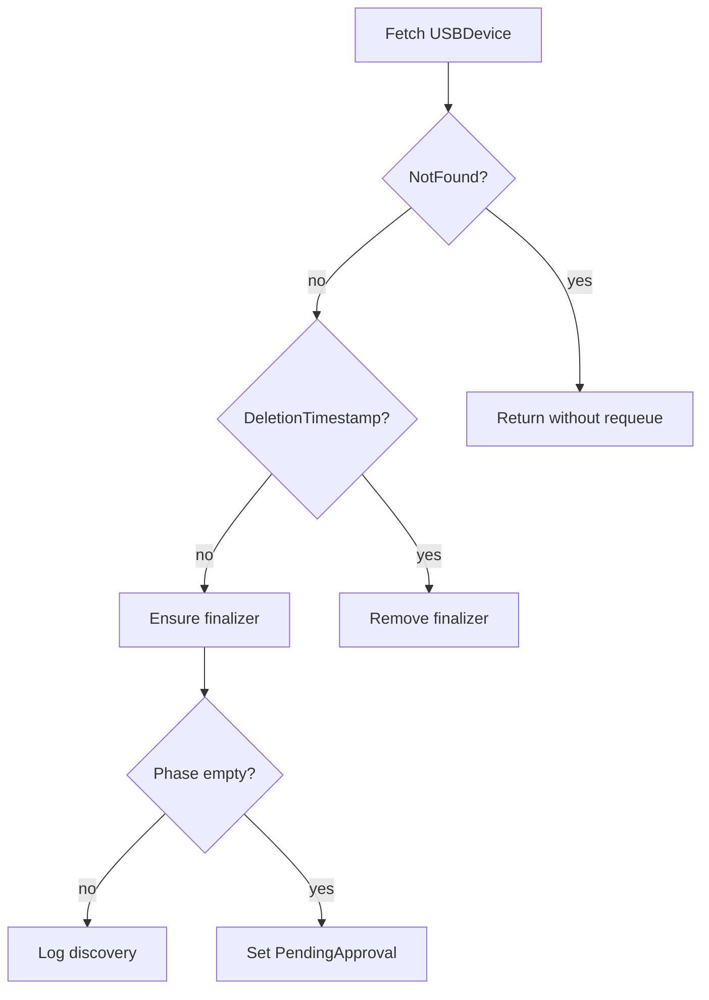
```mermaid
flowchart TD
    CheckDeletion -->|no| EnsureFinalizer["Ensure finalizer"]
    CheckDeletion -->|yes| RemoveFinalizer["Remove finalizer"]
    EnsureFinalizer --> InitStatus{"Phase empty?"}
    FetchDevice["Fetch USBDevice"] --> NotFound{"NotFound?"}
    InitStatus -->|no| LogEvent["Log discovery"]
    InitStatus -->|yes| SetPending["Set PendingApproval"]
    NotFound -->|no| CheckDeletion{"DeletionTimestamp?"}
    NotFound -->|yes| ReturnEmpty["Return without requeue"]
```

### Policy (Security)

_Source: `internal/security/policy.go`_

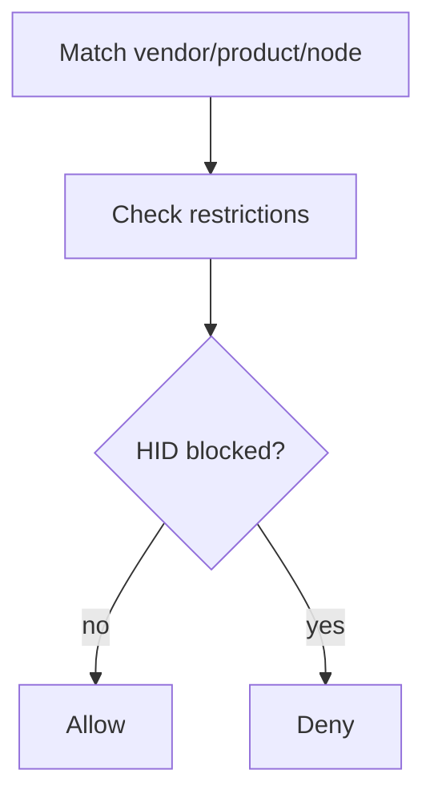
```mermaid
flowchart TD
    CheckHID -->|no| Allow["Allow"]
    CheckHID -->|yes| Deny["Deny"]
    CheckRestrictions --> CheckHID{"HID blocked?"}
    CheckSelector["Match vendor/product/node"] --> CheckRestrictions["Check restrictions"]
```

