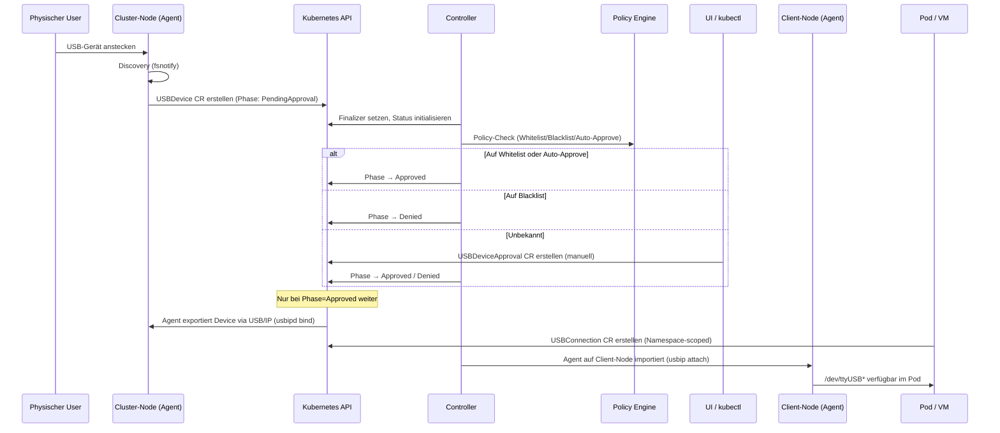

# KubeLink-USB — Implementierungsfortschritt & Roadmap

> Stand: April 2026 — Basierend auf tatsächlichem Code-Review aller Dateien.

---

## Gesamtfortschritt für v1.0

```
Gesamt: ████████░░░░░░░░░░░░ ~45%

CRD-API-Typen:        ████████████████████ 100%  (8 Ressourcen, DeepCopy, Scheme-Registration)
USBDevice Controller:  ████████████████████ 100%  (Finalizer, Status-Init, Deletion-Handling)
Backup/Restore:        ████████████████████ 100%  (Snapshot, Storage, Controller, HealthMonitor)
Discovery Watcher:     ████████████████████ 100%  (fsnotify, Event-Normalisierung, Pfad-Filter)
TLS + Whitelist:       ████████████████████ 100%  (TLS 1.3 Config, In-Memory-Set)
USB/IP Protocol:       ████░░░░░░░░░░░░░░░░  20%  (BasicHeader only)
Policy Engine:         ██░░░░░░░░░░░░░░░░░░  10%  (Stub: Allows() → true)
Approval Controller:   ░░░░░░░░░░░░░░░░░░░░   0%  (No-Op Stub)
Connection Controller: ░░░░░░░░░░░░░░░░░░░░   0%  (No-Op Stub)
Agent Export/Import:   ░░░░░░░░░░░░░░░░░░░░   0%  (Stubs returning nil)
Discovery→CR Bridge:   ░░░░░░░░░░░░░░░░░░░░   0%  (Discovery logs only, no K8s-CR-Erstellung)
Device Fingerprinting: ░░░░░░░░░░░░░░░░░░░░   0%  (Nicht vorhanden)
```

## Aktuelle Coverage-Zahlen

| Package | Coverage | CI-Minimum | Ziel |
|---------|----------|------------|------|
| **Gesamt** | **85.3%** | 80% | 85% |
| `api/v1alpha1` | 98.9% | 80% | 80% |
| `internal/security` | 100.0% | 80% | 90% |
| `internal/usbip` | 100.0% | 50% | 75% |
| `internal/utils` | 100.0% | 80% | 90% |
| `internal/backup` | 91.2% | — | 85% |
| `internal/controller` | 72.4% | — | 85% |
| `internal/agent` | 69.0% | — | 80% |
| `cmd/*` | 0.0% | — | — |

**Tests:** 53 Testfunktionen in 15 Dateien

---

## Was ist fertig ✅

### CRD-API-Typen (8 Ressourcen)
- [x] `USBDevice` — Geräte-Discovery-CR (Phase: PendingApproval→Approved→Connected→Disconnected)
- [x] `USBDeviceApproval` — Manuelle/Auto-Genehmigungen mit Ablaufzeit
- [x] `USBDevicePolicy` — Policy-Regeln (Vendor/Product/Node-Selektoren, Restrictions)
- [x] `USBConnection` — Tunnel-Lifecycle-CR (Phase: Pending→Connecting→Connected→Failed)
- [x] `USBDeviceWhitelist` — Bekannte sichere Geräte-Registry (Fingerprint-basiert)
- [x] `USBBackupConfig` — Backup-Speicherziel-Konfiguration (PVC/ConfigMap/S3)
- [x] `USBBackup` — Backup-Anfrage + Ergebnis (Phase: InProgress→Completed/Failed)
- [x] `USBRestore` — Restore-Anfrage mit DryRun + Health-Validierung
- [x] DeepCopy für alle Typen generiert und getestet (6 Tests)
- [x] Scheme-Registration in `groupversion_info.go`

### USBDevice Reconciler
- [x] Finalizer `kubelink-usb.io/cleanup-export` automatisch setzen
- [x] Status initialisieren: Phase=PendingApproval, LastSeen=now(), Health=Healthy
- [x] Deletion-Handling: Finalizer entfernen bei DeletionTimestamp
- [x] NotFound-Handling: sauberer Return ohne Fehler
- [x] Tests: 2 Testfunktionen (fake-client-basiert)

### Backup-System
- [x] `BackupStorage`-Interface (Write/Read/List/Delete)
- [x] `ConfigMapStorage` — Thread-safe In-Memory-Speicher (funktionsfähig)
- [x] `PVCStorage` — Interface vorhanden (Methoden sind Stubs)
- [x] `S3Storage` — Interface vorhanden (Methoden sind Stubs)
- [x] `NewStorage()` Factory — Routing nach Destination-Typ
- [x] Snapshot-Envelope: JSON mit Version, CreatedAt, SHA-256 Checksum, Data
- [x] `CreateSnapshot()`, `MarshalSnapshot()`, `UnmarshalSnapshot()`
- [x] `ValidateChecksum()` — Integritätsprüfung
- [x] `WriteSnapshot()` / `ReadSnapshot()` — Kompletter Zyklus
- [x] Tests: 13 Testfunktionen (Snapshot + Storage)

### Backup Controller
- [x] Sammelt alle Whitelists, Policies, Approvals
- [x] Erstellt Snapshot mit deterministischer Sortierung + Checksum
- [x] Schreibt in Storage-Backend
- [x] Phase-Transitions: InProgress → Completed/Failed
- [x] Status: Checksum, Size, ItemCounts, StorageRef
- [x] Retention-Enforcement (löscht älteste Backups nach Config)
- [x] Tests: 5 Testfunktionen

### Restore Controller
- [x] Multi-Phase: Validating → Restoring → RevalidatingConnections → Completed/Failed
- [x] Pre-Restore Health-Check (Backup existiert + Checksum valide)
- [x] DryRun-Modus: überspringt Restore, berichtet was passieren würde
- [x] Wendet alle CRs aus Snapshot an (Delete + Recreate)
- [x] Revalidiert alle USBConnections nach Restore
- [x] Auto-Fail mit klaren Fehlermeldungen
- [x] Tests: 6 Testfunktionen

### Health Monitor
- [x] `Check()` — prüft ob Whitelists, Policies, Approvals ladbar sind
- [x] Referentielle Integrität: Approvals→Policies-Verweise
- [x] `MaybeTriggerAutoRestore()` — automatischer Restore bei Unhealthy
- [x] Cooldown: 10 Minuten zwischen Auto-Restores
- [x] Max 3 Retries innerhalb von 24 Stunden
- [x] Tests: 8 Testfunktionen

### Discovery Watcher
- [x] Überwacht `/dev`, `/dev/serial`, `/dev/serial/by-id` via fsnotify
- [x] Event-Normalisierung: Create→add, Remove→remove, andere→change
- [x] USB-Pfad-Filter (Heuristik: /dev/ttyUSB*, /dev/ttyACM*, Serial-Pfade)
- [x] Graceful Shutdown bei Context-Cancellation
- [x] Tests: 5 Testfunktionen (Watcher, Event-Normalisierung, Pfad-Filter)

### Security Baseline
- [x] TLS 1.3+ Config via `TLSConfig()`
- [x] In-Memory Whitelist mit `Has()` und `Add()` (Thread-safe)
- [x] Tests: 3 Testfunktionen

### USB/IP Protocol Baseline
- [x] `BasicHeader` Struct (6 Bytes: Version + Code + Status, Big-Endian)
- [x] `Encode()` / `Decode()` via `binary.Write/Read`
- [x] Operation-Codes definiert: OPReqDevList, OPRepDevList, OPReqImport, OPRepImport
- [x] Tests: 3 Testfunktionen (Roundtrip, Binary-Format, Truncated-Input)

### Utilities
- [x] `IsTCPReachable(addr)` — TCP-Dial-Check
- [x] `ParseUSBIdentifiers(id)` — vendor:product String-Splitting
- [x] Tests: 2 Testfunktionen

### CI/CD
- [x] GitHub Actions Workflow: lint → test → coverage → build → images → docs → publish
- [x] Coverage-Gate: 80% Minimum (aktuell 85.3%)
- [x] Docker-Images: Controller + Agent
- [x] Docs-Generierung: CODE_REFERENCE.md
- [x] GHCR-Publishing auf main-Branch

---

## Was fehlt für v1.0 ❌

### Phase 1: Agent → Kubernetes-Verdrahtung (Grundlage)

#### 1.1 Device-Fingerprinting
- [ ] `internal/utils/fingerprint.go` — `DeviceFingerprint(nodeName, vendorID, productID, serialNumber) string`
- [ ] DNS-konforme, deterministische CR-Namen
- [ ] BusID-basierter Fallback für Geräte ohne Seriennummer
- [ ] Tests: Table-Driven (normale Eingaben, Sonderzeichen, leere Felder)

#### 1.2 Discovery→CR Bridge
- [ ] Event-Callback mit K8s-Client in Discovery
- [ ] `add`-Event → `USBDevice`-CR erstellen
- [ ] `remove`-Event → `USBDevice.Status.Phase = Disconnected`
- [ ] Reconnect-Erkennung via SerialNumber (kein Duplikat)
- [ ] `cmd/agent/main.go` — K8s-Client-Initialisierung (in-cluster Config)
- [ ] Tests: Fake-Client-basierte CR-Erstellung

### Phase 2: Approval-Workflow

#### 2.1 Policy-Engine implementieren
- [ ] `Engine.Allows()` — Vendor/Product/Node-Selector-Matching
- [ ] `allowedNodes`-Check
- [ ] `allowedDeviceClasses`-Check
- [ ] `denyHumanInterfaceDevices`-Check
- [ ] Whitelist-Lookup + Auto-Approve wenn konfiguriert
- [ ] Tests: Table-Driven (Match/Mismatch/HID/Node-Deny)

#### 2.2 Approval Controller implementieren
- [ ] `USBDeviceApproval` verarbeiten
- [ ] Device-Phase von PendingApproval → Approved/Denied
- [ ] Ablaufzeit-Prüfung (expiresAt)
- [ ] Automatische Approval-Erstellung bei neuem Device
- [ ] Tests: Fake-Client (Approve, Deny, Expired, Missing Device)

#### 2.3 Auto-Approve für bekannte Geräte
- [ ] Policy mit `autoApproveKnownDevices: true` + Whitelist-Match → direktes Approve
- [ ] Tests: Auto-Approve-Pfad

### Phase 3: USB/IP Tunnel-Management

#### 3.1 Server-seitiger Export (usbipd bind)
- [ ] `Export()` führt `usbipd bind --busid=<ID>` aus
- [ ] `Unexport()` führt `usbipd unbind` aus
- [ ] ConnectionInfo im USBDevice.Status setzen
- [ ] Tests: Mock-Executable statt echtes usbipd

#### 3.2 Client-seitiger Import (usbip attach)
- [ ] `Attach()` führt `usbip attach --remote=<host> --busid=<id>` aus
- [ ] `Detach()` entfernt VHCI-Port
- [ ] Device-Path-Parsing aus Attach-Output
- [ ] Tests: Mock-Executable

#### 3.3 USB Connection Controller implementieren
- [ ] Tunnel-Lifecycle orchestrieren: Export → Attach → Status-Update
- [ ] Phase-Transitions: Pending → Connecting → Connected → Failed
- [ ] Finalizer: Detach + Unexport bei Deletion
- [ ] TunnelInfo (ServerHost, Port, Protocol) befüllen
- [ ] Tests: Fake-Client (Happy-Path, Device-Not-Approved, Deletion)

#### 3.4 Vollständiges USB/IP-Protokoll
- [ ] DevList Request/Response Frames
- [ ] Import Request/Response Frames
- [ ] Transfer Submissions (URB-Forwarding)
- [ ] USB/IP Server (TCP-Listener)
- [ ] USB/IP Client (Connect + Negotiate)
- [ ] Tests: Encode/Decode Roundtrips, Malformed Input

### Phase 4: Resilience & Lifecycle

- [ ] Reconnect-Logik (Retry mit konfiguriertem Backoff)
- [ ] Disconnect-Timeout
- [ ] Device-Hotplug-Handling (Reconnect via SerialNumber)

### Phase 5: Security & Encryption

- [ ] mTLS für USB/IP-Tunnel (wenn `requireEncryption: true`)
- [ ] cert-manager-Integration
- [ ] Network Isolation (automatische NetworkPolicy-Erstellung)

### Phase 6: CLI & UI (Optional für v1.0)

- [ ] kubectl-usb Plugin (`list`, `approve`, `deny`, `connect`, `disconnect`)

### Phase 7: Webhooks (Optional für v1.0)

- [ ] Validating Webhook für Policies (VendorID/ProductID-Format)
- [ ] Mutating Webhook für Defaults

### Phase 8: Observability (Optional für v1.0)

- [ ] Prometheus Metrics
- [ ] Kubernetes Events für Statusübergänge

### Phase 9: Distribution (Optional für v1.0)

- [ ] Multi-Architecture Images (ARM64 + amd64)
- [ ] Helm Chart
- [ ] PVC Backup Storage implementieren
- [ ] S3 Backup Storage implementieren

---

## Kritischer Pfad für v1.0 (Minimum Viable Product)

Für eine erste funktionsfähige Version werden **Phasen 1-3** benötigt:

```
Phase 1 (Grundlage):     ~2-3 Tage Arbeit
├── Device Fingerprinting
└── Discovery→CR Bridge

Phase 2 (Approval):      ~3-4 Tage Arbeit
├── Policy Engine
├── Approval Controller
└── Auto-Approve

Phase 3 (Tunnels):       ~5-7 Tage Arbeit
├── Server Export (usbipd)
├── Client Import (usbip)
├── Connection Controller
└── USB/IP Protocol

Geschätzter Aufwand bis v1.0-MVP: ~10-14 Arbeitstage
```

Phasen 4-9 sind für v1.1+ geplant und nicht für das MVP erforderlich.

---

## Geplanter E2E-Workflow (Zielzustand)



---

## Teststrategie

### Testarten pro Komponente

| Komponente | Art | Tests | Status |
|------------|-----|-------|--------|
| CRD DeepCopy | Unit | 6 | ✅ |
| Discovery | Unit | 5 | ✅ |
| Agent Client/Server | Unit (Stubs) | 2 | ⚠️ Erweiterung nötig |
| USB/IP Protocol | Unit | 3 | ⚠️ Erweiterung nötig |
| USB/IP Client/Server | Unit (Stubs) | 2 | ⚠️ Erweiterung nötig |
| Backup Snapshot | Unit | 8 | ✅ |
| Backup Storage | Unit | 5 | ✅ |
| Security | Unit | 3 | ⚠️ Policy-Engine-Tests fehlen |
| USBDevice Controller | Fake-Client | 2 | ✅ |
| Additional Controllers | Fake-Client | 2 | ✅ |
| Backup Controller | Fake-Client | 5 | ✅ |
| Restore Controller | Fake-Client | 6 | ✅ |
| Health Monitor | Fake-Client | 8 | ✅ |
| Utils | Unit | 2 | ✅ |

### CI-Gates

| Gate | Aktuell | Status |
|------|---------|--------|
| `make lint` | gofmt + go vet | ✅ Besteht |
| `make test` | 53 Tests, alle grün | ✅ Besteht |
| `make coverage-check` | 85.3% ≥ 80% | ✅ Besteht |
| `make build` | bin/controller + bin/agent | ✅ Besteht |
| `make docs` + git diff | CODE_REFERENCE.md aktuell | ✅ Besteht |
