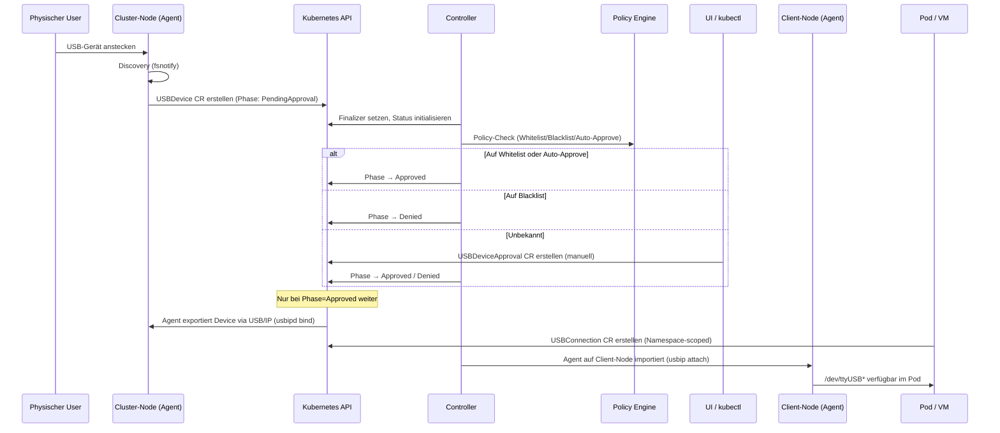

# KubeLink-USB — Konkrete TODO-Liste

> Basierend auf der Ist-Analyse des Repositorys, dem geplanten Workflow und den identifizierten Lücken.

## Geplanter E2E-Workflow (Zielzustand)



---

## Phase 1: Agent → Kubernetes Wiring

### TODO-1.1: Discovery-zu-CR-Bridge

**Beschreibung:** Der Agent (`internal/agent/discovery.go`) erkennt USB-Events per fsnotify und loggt sie. Es fehlt die Brücke zum Kubernetes API-Server: Bei einem `add`-Event muss automatisch ein `USBDevice`-CR erstellt werden, bei `remove` muss der Status auf `Disconnected` gesetzt werden.

**Betroffene Dateien:**
- `internal/agent/discovery.go` — Event-Callback mit K8s-Client
- `cmd/agent/main.go` — K8s-Client-Initialisierung und in-cluster Config

**Akzeptanzkriterien:**
- Einstecken eines USB-Geräts → `USBDevice`-CR wird automatisch erstellt
- Abziehen → `USBDevice.Status.Phase` wird `Disconnected`
- Gleiches Gerät reinstecken (via SerialNumber) → existierendes CR wird aktualisiert, nicht dupliziert
- Agent läuft als DaemonSet auf jedem Node

### TODO-1.2: Device-Fingerprinting

**Beschreibung:** Geräte müssen zuverlässig über Einsteck-Vorgänge hinweg identifiziert werden. Aktuell gibt es `vendorID`, `productID`, `serialNumber` im Spec. Es fehlt eine deterministische Namensgenerierung (`<nodeName>-<vendorID>-<productID>-<serial>`) und die Erkennung von Reconnects.

**Betroffene Dateien:**
- `internal/utils/` — neue Hilfsfunktion `DeviceFingerprint()`
- `internal/agent/discovery.go` — Fingerprint-Nutzung bei CR-Erstellung

**Akzeptanzkriterien:**
- Gleiche physische Geräte erzeugen immer denselben CR-Namen
- Geräte ohne Seriennummer bekommen einen BusID-basierten Fallback

---

## Phase 2: Approval-Workflow

### TODO-2.1: Policy-Engine implementieren

**Beschreibung:** `security/policy.go` `Engine.Allows()` gibt aktuell immer `true` zurück. Die Engine muss die `USBDevicePolicy`-Selektoren (vendorID, productID, nodeNames) gegen das `USBDevice` matchen und die Restrictions auswerten.

**Betroffene Dateien:**
- `internal/security/policy.go` — Selector-Matching, Restriction-Auswertung
- `internal/security/whitelist.go` — Persistente Whitelist (aktuell nur in-memory)

**Akzeptanzkriterien:**
- Device mit passendem VendorID/ProductID-Selector wird von der Policy erfasst
- `allowedNodes`-Check blockiert Devices auf nicht-erlaubten Nodes
- `allowedDeviceClasses`-Check blockiert nicht-erlaubte Geräteklassen
- `denyHumanInterfaceDevices` blockiert HID-Klasse
- Whitelist-Lookup: bekanntes Gerät → Auto-Approve wenn `autoApproveKnownDevices: true`

### TODO-2.2: ApprovalReconciler implementieren

**Beschreibung:** `internal/controller/approval_controller.go` ist ein Placeholder (return nil). Der Reconciler muss `USBDeviceApproval`-CRs verarbeiten und den `USBDevice.Status.Phase` von `PendingApproval` auf `Approved` oder `Denied` setzen.

**Betroffene Dateien:**
- `internal/controller/approval_controller.go` — Reconcile-Logik
- `internal/controller/usbdevice_controller.go` — Reagiert auf Phase-Wechsel

**Akzeptanzkriterien:**
- Neues `USBDeviceApproval`-CR mit `phase: Approved` → Device-Phase wird `Approved`
- `phase: Denied` → Device-Phase wird `Denied`
- Approval mit `expiresAt` in der Vergangenheit → wird abgelehnt
- Approval ohne passende Policy → wird abgelehnt
- Automatische Approval-Erstellung bei neuem Device (wenn Policy `mode: manual`)

### TODO-2.3: Auto-Approve für bekannte Geräte

**Beschreibung:** Wenn eine `USBDevicePolicy` `autoApproveKnownDevices: true` hat und das Gerät (Fingerprint) in der Whitelist steht, soll kein manuelles Approval nötig sein.

**Betroffene Dateien:**
- `internal/controller/usbdevice_controller.go` — Policy-Lookup nach CR-Erstellung
- `internal/security/whitelist.go` — Persistenter Whitelist-Speicher (ConfigMap oder CRD-basiert)

**Akzeptanzkriterien:**
- Bekanntes Gerät + passende Policy mit Auto-Approve → Phase geht direkt auf `Approved`
- Unbekanntes Gerät → bleibt auf `PendingApproval`

---

## Phase 3: USB/IP Tunnel-Management

### TODO-3.1: Server-seitiger Export (usbipd bind)

**Beschreibung:** `internal/agent/server.go` `Export()`/`Unexport()` sind leere Stubs. Sie müssen `usbipd bind --busid=<ID>` auf dem Source-Node ausführen und den Export-Status zurückmelden.

**Betroffene Dateien:**
- `internal/agent/server.go` — `os/exec`-basierte usbipd-Aufrufe
- `internal/usbip/server.go` — TCP-Listener für USB/IP-Protokoll

**Akzeptanzkriterien:**
- `Export()` führt `usbipd bind` aus und meldet Erfolg/Fehler
- `Unexport()` führt `usbipd unbind` aus
- Fehler (Gerät nicht vorhanden, Permission denied) werden korrekt propagiert
- ConnectionInfo (Host, Port, ExportedBusID) wird im `USBDevice.Status` gesetzt

### TODO-3.2: Client-seitiger Import (usbip attach)

**Beschreibung:** `internal/agent/client.go` `Attach()`/`Detach()` sind leere Stubs. Sie müssen `usbip attach --remote=<host> --busid=<id>` auf dem Client-Node ausführen.

**Betroffene Dateien:**
- `internal/agent/client.go` — `os/exec`-basierte usbip-Aufrufe
- `internal/usbip/client.go` — Verbindungsaufbau

**Akzeptanzkriterien:**
- `Attach()` gibt den resultierenden `/dev/ttyUSB*`-Pfad zurück
- `Detach()` entfernt den VHCI-Port sauber
- Bei Netzwerkfehler: sinnvolle Fehlermeldung
- `USBConnection.Status.ClientDevicePath` wird gesetzt

### TODO-3.3: USBConnectionReconciler implementieren

**Beschreibung:** `internal/controller/usbconnection_controller.go` ist ein Placeholder. Der Reconciler muss den Tunnel-Lifecycle orchestrieren: Export auf Source-Node triggern, Attach auf Client-Node triggern, Status aktualisieren.

**Betroffene Dateien:**
- `internal/controller/usbconnection_controller.go` — Reconcile-Logik
- Agent-Kommunikation (gRPC oder REST zwischen Controller und DaemonSet-Agents)

**Akzeptanzkriterien:**
- Neue `USBConnection` → Export + Attach werden ausgelöst
- `USBConnection.Status.Phase` durchläuft: `Pending → Connecting → Connected → Disconnected`
- Löschen der `USBConnection` → Detach + Unexport (Finalizer)
- TunnelInfo (ServerHost, ServerPort, Protocol) wird korrekt befüllt

---

## Phase 4: Resilience & Lifecycle

### TODO-4.1: Reconnect-Logik

**Beschreibung:** Bei Netzwerkunterbrechung oder temporärem Device-Verlust soll der Agent Reconnect-Versuche mit konfiguriertem Backoff durchführen (`USBDeviceLifecycle`).

**Betroffene Dateien:**
- `internal/agent/client.go` — Retry-Loop mit Backoff
- `internal/controller/usbconnection_controller.go` — Requeue bei Fehler

**Akzeptanzkriterien:**
- Netzwerkausfall → automatische Retry-Versuche (max `reconnectAttempts`)
- Backoff zwischen Versuchen (`reconnectBackoff`)
- Nach Ablauf aller Versuche → Status `Failed`, Kubernetes Event
- Device-Hotplug (rausziehen + reinstecken) → automatischer Reconnect via SerialNumber-Match

### TODO-4.2: Disconnect-Timeout

**Beschreibung:** Wenn ein exportiertes Device für länger als `disconnectTimeout` nicht erreichbar ist, soll die Connection als `Failed` markiert werden.

**Betroffene Dateien:**
- `internal/controller/usbconnection_controller.go` — Timeout-Check bei Requeue
- `internal/agent/server.go` — Health-Check für exportierte Devices

**Akzeptanzkriterien:**
- Connection ohne Heartbeat > `disconnectTimeout` → Phase `Failed`
- Abgelaufene Connection wird gesäubert (Finalizer-Flow)

---

## Phase 5: Security & Encryption

### TODO-5.1: mTLS für USB/IP-Tunnel

**Beschreibung:** `security/encryption.go` liefert eine TLS-1.3-Config. Diese muss in den USB/IP-Tunnel integriert werden, wenn `requireEncryption: true` in der Policy gesetzt ist.

**Betroffene Dateien:**
- `internal/usbip/server.go` — TLS-Wrapper um TCP-Listener
- `internal/usbip/client.go` — TLS-Dial
- `internal/security/encryption.go` — Zertifikat-Management (cert-manager-Integration)

**Akzeptanzkriterien:**
- Policy mit `requireEncryption: true` → Tunnel nutzt mTLS
- Ohne Flag → Plain TCP (abwärtskompatibel)
- Ungültiges Zertifikat → Verbindung wird abgelehnt

### TODO-5.2: Network Isolation

**Beschreibung:** Bei `networkIsolation: true` soll der Controller automatisch Kubernetes `NetworkPolicy`-Objekte erstellen, die den USB/IP-Traffic auf die beteiligten Nodes beschränken.

**Betroffene Dateien:**
- `internal/controller/usbconnection_controller.go` — NetworkPolicy-Erstellung
- Neues Package oder Hilfsfunktion für NetworkPolicy-Generierung

**Akzeptanzkriterien:**
- NetworkPolicy erlaubt nur Traffic zwischen Source-Node und Client-Node auf dem USB/IP-Port
- Policy wird bei Löschen der Connection wieder entfernt
- Ohne Flag → keine NetworkPolicy

---

## Phase 6: API & Benutzeroberfläche

### TODO-6.1: kubectl-usb CLI Plugin

**Beschreibung:** Ein kubectl-Plugin für die häufigsten Operationen, als Alternative zum manuellen CR-Erstellen.

**Neues Package:** `cmd/kubectl-usb/`

**Befehle:**
- `kubectl usb list` — Alle Devices mit Status anzeigen
- `kubectl usb approve <device>` — Device genehmigen
- `kubectl usb deny <device>` — Device ablehnen
- `kubectl usb connect <device> --node <target>` — Connection erstellen
- `kubectl usb disconnect <connection>` — Connection löschen

**Akzeptanzkriterien:**
- Jeder Befehl funktioniert mit Standard-Kubeconfig
- Tabellenausgabe mit Phase, Node, VendorID, ProductID

### TODO-6.2: REST-API / Web-UI (Optional, spätere Phase)

**Beschreibung:** Optional kann ein leichtgewichtiges Web-Frontend die unangemeldeten Devices anzeigen und Approval per Button ermöglichen.

**Mögliche Architektur:**
- Einfacher HTTP-Server im Controller-Binary oder als separater Deployment
- REST-Endpunkte: `GET /api/devices`, `POST /api/devices/{name}/approve`, `POST /api/devices/{name}/deny`
- Statisches Frontend (z.B. React/Vue) oder Server-Side-Rendered

**Akzeptanzkriterien:**
- Liste aller Devices mit Filtermöglichkeit nach Status
- Approve/Deny-Button pro Device
- Authentifizierung über Kubernetes ServiceAccount / OIDC

---

## Phase 7: Webhooks & Validation

### TODO-7.1: Validating Webhook für Policies

**Beschreibung:** VendorID/ProductID-Format validieren (4-stellige Hex), widersprüchliche Restrictions erkennen.

**Betroffene Dateien:**
- Neuer Webhook unter `internal/webhook/` oder `api/v1alpha1/`

**Akzeptanzkriterien:**
- Ungültige VendorID (nicht 4-stellig Hex) → Admission-Reject
- `maxConcurrentConnections < 0` → Admission-Reject

### TODO-7.2: Mutating Webhook für Defaults

**Beschreibung:** Sinnvolle Defaults setzen wenn Felder fehlen (z.B. `approval.mode: "manual"`, `lifecycle.reconnectAttempts: 3`).

**Akzeptanzkriterien:**
- Fehlende Felder werden mit Defaults befüllt
- Explizit gesetzte Felder werden nicht überschrieben

---

## Phase 8: Observability & Operations

### TODO-8.1: Prometheus Metrics

**Beschreibung:** Metriken für Monitoring: aktive Tunnel, Discovery-Rate, Fehler, Approval-Wartezeit.

**Metriken:**
- `kubelink_usb_devices_total{phase}` — Gauge pro Phase
- `kubelink_usb_connections_active` — Gauge aktiver Tunnel
- `kubelink_usb_discovery_events_total{type}` — Counter
- `kubelink_usb_approval_duration_seconds` — Histogram

### TODO-8.2: Kubernetes Events

**Beschreibung:** Wichtige Statusübergänge als Kubernetes Events emittieren.

**Events:**
- `DeviceDiscovered` — Neues Gerät erkannt
- `DeviceApproved` / `DeviceDenied` — Approval-Entscheidung
- `TunnelEstablished` / `TunnelFailed` — Tunnel-Status
- `ReconnectAttempt` / `ReconnectExhausted` — Resilience-Events

---

## Phase 9: Multi-Arch & Distribution

### TODO-9.1: Multi-Architecture Container Images

**Beschreibung:** ARM64 (Raspberry Pi) und amd64 Support für alle Container Images.

**Betroffene Dateien:**
- `Dockerfile`, `Dockerfile.agent` — Multi-stage mit `--platform`
- `.github/workflows/unit-tests.yml` — Buildx-Setup

### TODO-9.2: Helm Chart

**Beschreibung:** Helm Chart für einfaches Deployment im Cluster.

**Neues Verzeichnis:** `charts/kubelink-usb/`

---

# Testkonzept — Vollständigkeit und Coverage

## Coverage-Ziele (bestehend + erweitert)

| Package | Aktuell | Minimum | Ziel | Strategie |
|---------|---------|---------|------|-----------|
| **Gesamt** | ~80% | 80% | 85% | `hack/coverage-check.sh` |
| `internal/security` | ~80% | 80% | 90% | Policy-Engine hat viele Verzweigungen → hohe Coverage nötig |
| `internal/usbip` | ~50% | 50% | 75% | Protocol-Encoding muss lückenlos getestet sein |
| `internal/controller` | ~70% | 70% | 85% | Jeder Reconcile-Pfad (success + error) |
| `internal/agent` | ~60% | 60% | 80% | Discovery + Client/Server Lifecycle |
| `internal/utils` | ~90% | 80% | 90% | Reine Funktionen, einfach testbar |
| `api/v1alpha1` | ~80% | 80% | 80% | DeepCopy ist generiert, nur Smoke-Tests |

## Teststrategie pro Komponente

### 1. Policy-Engine (`internal/security`)

**Art:** Table-Driven Unit-Tests

```
Testfälle für Engine.Allows():
- Device matches Policy-Selector → true
- Device VendorID mismatch → false
- Device auf erlaubtem Node → true
- Device auf nicht-erlaubtem Node → false
- HID-Device + denyHumanInterfaceDevices → false
- Leere Policy (kein Selector) → default allow/deny
- Mehrere Policies matchen → Priorität/Merge-Verhalten
```

**Whitelist-Tests:**
```
- Add → Has = true
- Nicht-Add → Has = false
- Doppeltes Add → idempotent
- Persistenz-Roundtrip (wenn persistent implementiert)
```

### 2. Controller-Reconciler (`internal/controller`)

**Art:** Fake-Client-basierte Tests (kein envtest nötig für Entscheidungslogik)

```
USBDeviceReconciler:
- Neues Device → Phase = PendingApproval ✅ (existiert)
- Device mit Policy + Whitelist → Phase = Approved
- Device mit Policy + Blacklist → Phase = Denied
- Deletion → Finalizer entfernt ✅ (existiert)
- Fehler bei Status-Update → Error propagiert

ApprovalReconciler:
- Approval mit Phase=Approved → Device-Phase wird Approved
- Approval mit Phase=Denied → Device-Phase wird Denied
- Approval abgelaufen (expiresAt) → wird ignoriert
- Approval ohne existierendes Device → Error/Ignore

USBConnectionReconciler:
- Connection für Approved Device → Phase = Connecting
- Connection für nicht-Approved Device → Phase = Denied
- Deletion → Detach + Unexport ausgelöst
- maxConcurrentConnections überschritten → Phase = Denied
```

### 3. Agent-Komponenten (`internal/agent`)

**Art:** Unit-Tests + Integration-Tests mit Mock-Executables

```
Discovery:
- fsnotify Create → add Event ✅ (existiert)
- fsnotify Remove → remove Event ✅ (existiert)
- USB-Pfad-Erkennung ✅ (existiert)
- NEU: Event → K8s-CR-Erstellung (mit Fake-Client)
- NEU: Reconnect-Erkennung via SerialNumber

Server:
- Export() → prüfe dass usbipd-Kommando korrekt aufgebaut wird
- Unexport() → prüfe Cleanup
- Export fehlschlägt → Error korrekt
- NEU: Mock-Executable statt echtes usbipd (os/exec-Interface)

Client:
- Attach() → prüfe Kommando + Device-Path-Parsing
- Detach() → prüfe Cleanup
- NEU: Mock-Executable
```

### 4. USB/IP Protocol (`internal/usbip`)

**Art:** Table-Driven Tests für Encoding, Integration-Tests für Client/Server

```
Protocol:
- BasicHeader Encode/Decode Roundtrip ✅ (existiert)
- Truncated Input → Error ✅ (existiert)
- NEU: DevList Request/Response Encoding
- NEU: Import Request/Response Encoding
- NEU: Malformed Header → Error (Fuzzing)

Server/Client Integration:
- In-Process Server + Client → successful DevList exchange
- Server nicht erreichbar → Timeout-Error
- NEU: TLS-Handshake (wenn requireEncryption)
```

### 5. E2E-Tests (Spätere Phase)

**Art:** envtest oder echtes Kind-Cluster

```
Szenario 1 — Happy Path:
1. USBDevice CR erstellen
2. Prüfe Phase = PendingApproval
3. USBDeviceApproval CR erstellen (Approved)
4. Prüfe Device Phase = Approved
5. USBConnection CR erstellen
6. Prüfe Connection Phase = Connected (mit Mock-Agent)
7. Connection löschen
8. Prüfe Cleanup

Szenario 2 — Policy-Deny:
1. USBDevicePolicy mit allowedNodes: ["node-b"]
2. Device auf node-a erstellen
3. Prüfe Phase bleibt PendingApproval oder wird Denied

Szenario 3 — Auto-Approve:
1. Policy mit autoApproveKnownDevices: true
2. Device-Fingerprint in Whitelist
3. Device erstellen → Prüfe Phase = Approved (ohne manuelles Approval)
```

## CI-Integration

Der bestehende CI-Workflow (`.github/workflows/unit-tests.yml`) muss erweitert werden:

1. **Coverage-Gates erweitern** — `hack/coverage-check.sh` um neue Package-Minima ergänzen
2. **Controller-Package hinzufügen** — `CONTROLLER_MIN_COVERAGE=70` als Gate
3. **Agent-Package hinzufügen** — `AGENT_MIN_COVERAGE=60` als Gate
4. **E2E-Workflow** (optional, spätere Phase) — Kind-Cluster mit installiertem CRD

## Vollständigkeits-Prüfung

Für jede TODO wird ein abgeschlossener Zustand wie folgt verifiziert:

| Kriterium | Prüfmethode |
|-----------|-------------|
| Unit-Tests vorhanden | `go test ./internal/<pkg>` deckt alle neuen Funktionen ab |
| Coverage-Minimum erreicht | `make coverage-check` besteht im CI |
| Kein Regression | Alle bestehenden Tests grün |
| Docs aktuell | `make docs` generiert konsistente Ausgabe |
| Lint sauber | `make lint` (gofmt + go vet) besteht |
| Binaries bauen | `make build` erfolgreich |
| Container bauen | `make docker-build` erfolgreich |
