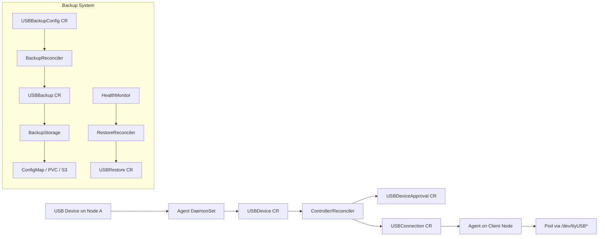
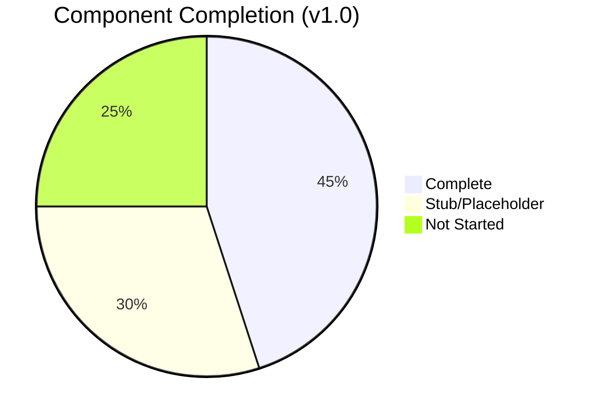
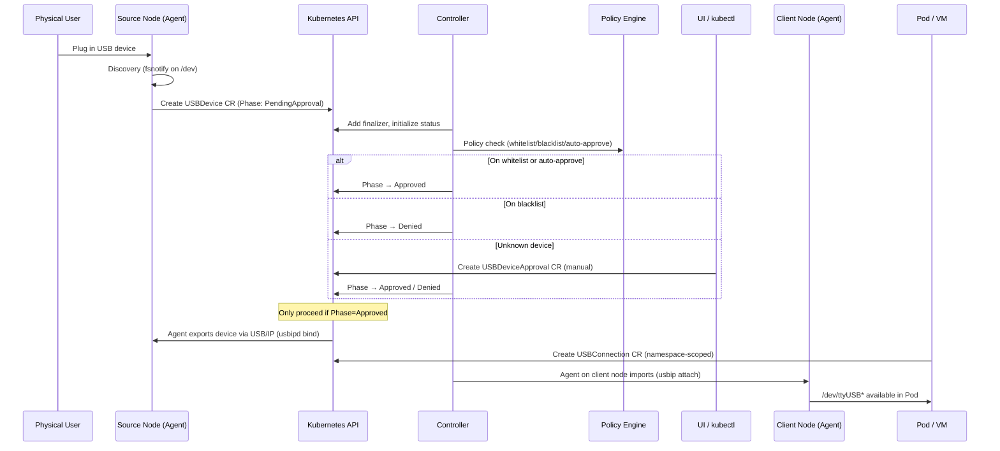
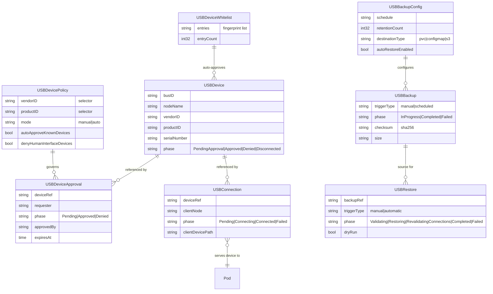
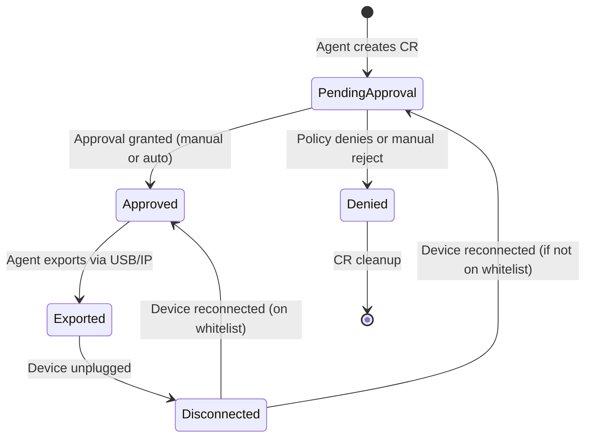
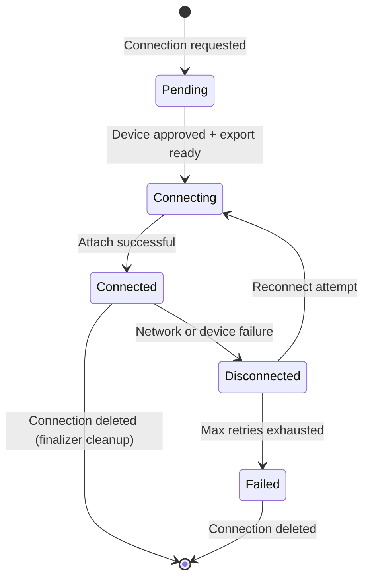
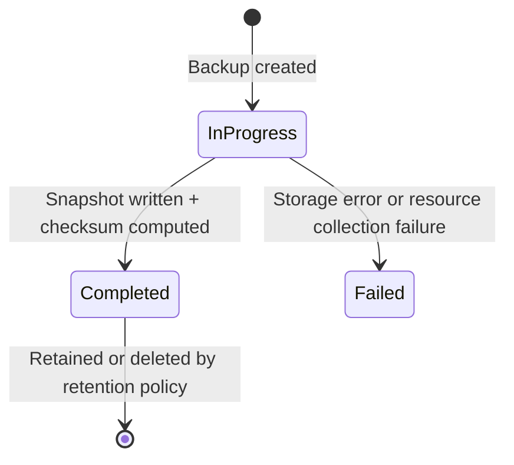
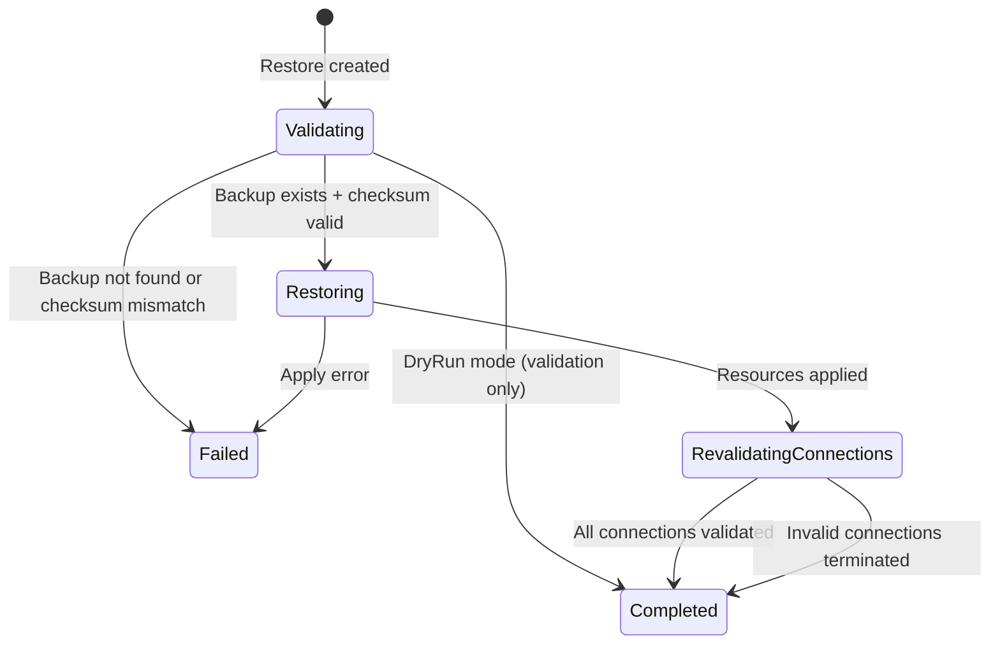

# Architecture

## Component Overview

## Implementation Status

| Component | Status | Notes |
|-----------|--------|-------|
| CRD API Types (8 resources) | ✅ Complete | USBDevice, Approval, Policy, Connection, Whitelist, BackupConfig, Backup, Restore |
| USBDevice Reconciler | ✅ Complete | Finalizer + status init (PendingApproval, LastSeen, Healthy) |
| Backup Controller | ✅ Complete | Snapshot collection, storage write, retention enforcement |
| Restore Controller | ✅ Complete | 5-phase lifecycle, dry-run, connection revalidation |
| Health Monitor | ✅ Complete | Consistency checks, auto-restore (10min cooldown, 3 retries) |
| Discovery Watcher | ✅ Complete | fsnotify on /dev, event normalization, USB path filtering |
| TLS Baseline | ✅ Complete | TLS 1.3 minimum config |
| Whitelist (in-memory) | ✅ Complete | Thread-safe string set |
| USB/IP BasicHeader | ✅ Complete | 6-byte encode/decode |
| ConfigMap Backup Storage | ✅ Complete | Thread-safe in-memory map |
| Policy Engine | ⚠️ Stub | `Allows()` → always true |
| Approval Controller | ⚠️ Stub | Returns nil (no-op) |
| Connection Controller | ⚠️ Stub | Returns nil (no-op) |
| Agent Client (Attach/Detach) | ⚠️ Stub | Returns nil |
| Agent Server (Export/Unexport) | ⚠️ Stub | Returns nil |
| USB/IP Client (Connect) | ⚠️ Stub | Returns nil |
| USB/IP Server (Serve) | ⚠️ Stub | Returns nil |
| PVC Backup Storage | ⚠️ Stub | Interface only |
| S3 Backup Storage | ⚠️ Stub | Interface only |
| Device Fingerprinting | ❌ Missing | Needed for deterministic CR names |
| Discovery→CR Bridge | ❌ Missing | Discovery logs but doesn't create CRs |
| Full USB/IP Protocol | ❌ Missing | Only BasicHeader, no device list/import frames |

## End-to-End Workflow (Target State)

## CRD Relationships

## Phase Transitions

### USBDevice Lifecycle

### USBConnection Lifecycle

### USBBackup Lifecycle

### USBRestore Lifecycle

## Backup/Restore Architecture

```mermaid
flowchart TD
    subgraph Backup Flow
        A[BackupReconciler] -->|List| B[Whitelists + Policies + Approvals]
        B -->|CreateSnapshot| C[Snapshot with SHA-256 checksum]
        C -->|Write| D[BackupStorage Interface]
        D --> E[ConfigMap Storage ✅]
        D --> F[PVC Storage ⚠️ stub]
        D --> G[S3 Storage ⚠️ stub]
    end

    subgraph Restore Flow
        H[RestoreReconciler] -->|Phase 1| I[Validate backup + checksum]
        I -->|Phase 2| J[Delete + recreate CRs from snapshot]
        J -->|Phase 3| K[Revalidate all USBConnections]
        K -->|Phase 4| L[Mark Completed]
    end

    subgraph Health Monitor
        M[HealthMonitor.Check] -->|Unhealthy?| N[MaybeTriggerAutoRestore]
        N -->|Cooldown OK?| O[Create USBRestore CR]
        N -->|Max retries?| P[Give up]
    end
```

## Security Model

- Manual approval by default (`PendingApproval` → `Approved`)
- Policy whitelist/blacklist controls via `USBDevicePolicy` selector
- Auto-approve known devices via fingerprint whitelist
- Optional mTLS encryption for USB/IP tunnels (`requireEncryption` flag)
- Network isolation via automatic `NetworkPolicy` generation (planned)
- HID device class blocking (`denyHumanInterfaceDevices`)
- Namespace-scoped connections with allowed-namespace restrictions
- Finalizer-based cleanup for exported devices and tunnel teardown
- Max concurrent connections limit per device
- Backup integrity via SHA-256 checksums
- Auto-restore with cooldown (10min) and retry limits (max 3)
