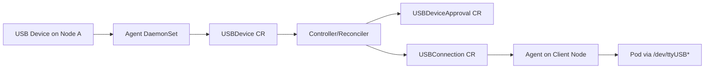
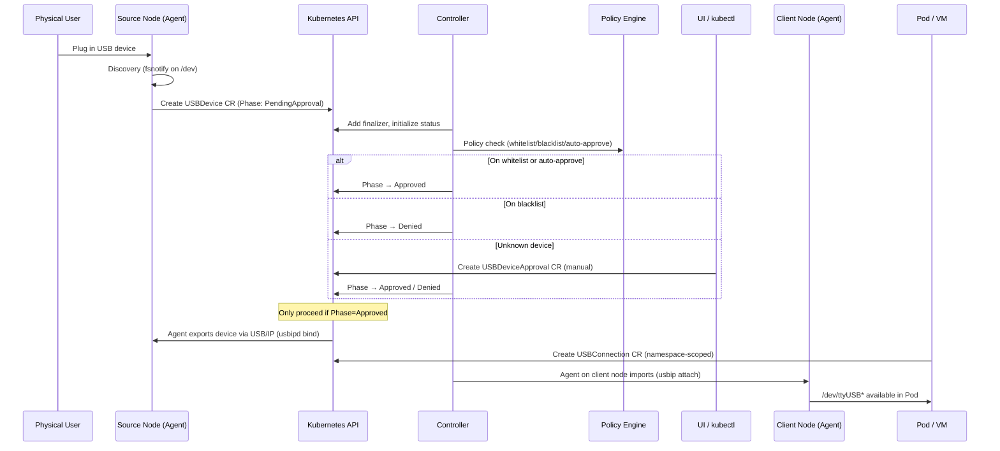
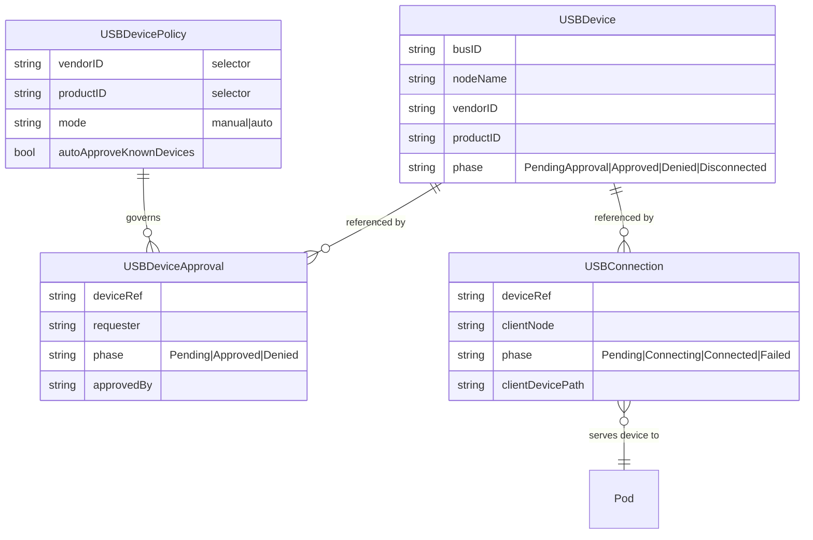
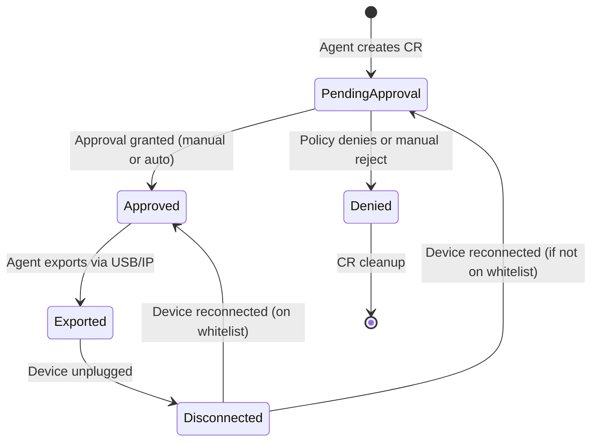
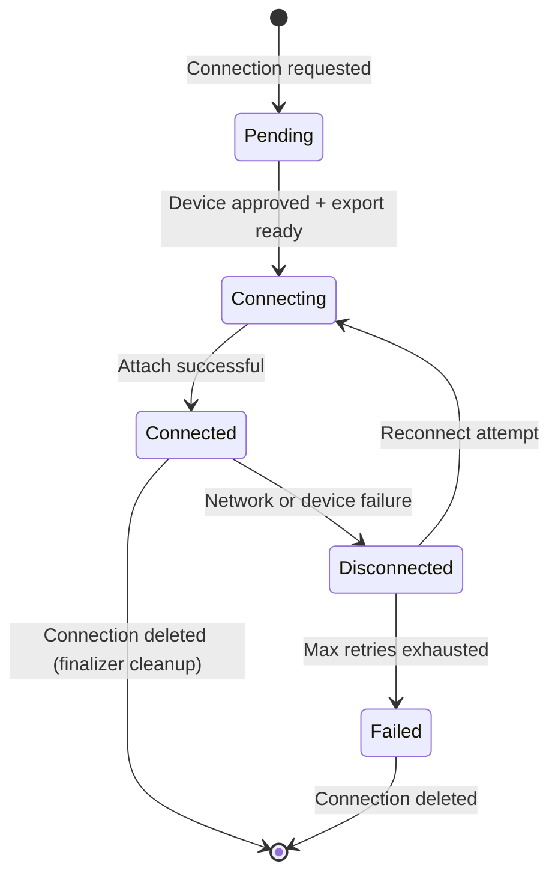

# Architecture

## Component Overview

## End-to-End Workflow

## CRD Relationships

## Phase Transitions

### USBDevice Lifecycle

### USBConnection Lifecycle

## Security Model

- Manual approval by default (`PendingApproval` → `Approved`)
- Policy whitelist/blacklist controls via `USBDevicePolicy` selector
- Auto-approve known devices via fingerprint whitelist
- Optional mTLS encryption for USB/IP tunnels (`requireEncryption` flag)
- Network isolation via automatic `NetworkPolicy` generation
- HID device class blocking (`denyHumanInterfaceDevices`)
- Namespace-scoped connections with allowed-namespace restrictions
- Finalizer-based cleanup for exported devices and tunnel teardown
- Max concurrent connections limit per device
