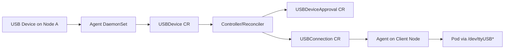

# Architecture

## Security Model

- Manual approval by default (`PendingApproval` -> `Approved`)
- Policy whitelist/blacklist controls
- Optional encryption requirement through policy flag
- Finalizer-based cleanup for exported devices
